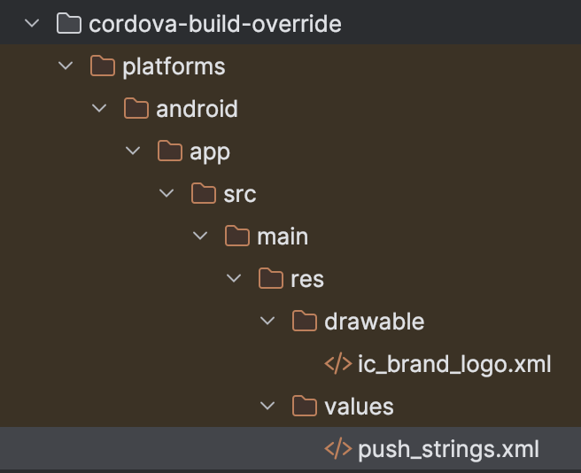

# VoIP Videocall Callscreen Support

Enable Videocalls to be triggered on remote devices by sending a push notification. 

This plugin allows for the displaying of a calling screen and then the activation of the app if the
user "picks up" the phone using Push Notifications to trigger the call.

The user can also choose to decline the call.

### Note 1: This plugin, out of the box, supports only **Android** VoIP Pushes.

You can use another plugin, [Customized iOS Callkit Plugin](cordova-plugin-callkit@https://github.com/trusted-care/cordova-plugin-callkit.git#1906e36e900fa3dd500d9a7cc174332d6dfa6caa) to add the same functionality to your iOS app as well.

### Note 2: Additional help is available

If you want to integrate this in your app, we can share additional code & information on the implementation on the 
client / Javascript side too, please get in touch with us -> daniel at dornhardt dot com & we can go from there.

## How to do it?

 - Add additional information to the push payload
 - Customize the call screen for use with your app

## Push Payload:

In order to activate the calling screen in the app, you need to add the following to your push & the push plugin will show a calling screen:

```js
  var content = {
  priority: 'normal', // Valid values are "normal" and "high."
  data: {
    from: "Your Appname",
    title: '',                            // title isn't necessary because the PN isn't visible
    body: 'Incoming Call',                // the text that is displayed in the notification
    sound: 'default',
    vibrate: true,
    userId: our_user_id,                  // add additional information you might need in the cordova app (?)
    voip: true,                           // THIS activates the callscreen
    caller: `${currentUser.profile.firstname} ${currentUser.profile.lastname}`,   // construct a nice caller name for the call screen
    isCancelPush: `${isCancel}`,          // set this to true  if you sent a call push before to _hang up_ the
                                          // call in case the caller gives up before the recipient accepts or cancels the call
    callId: 'individual_call_identifier', // we use this to create two webhook URLs which allow the plugin (see below)
                                          // to update the call status on the calling server / app
    callbackUrl: `${getExternalRootUrl()}updateStatus`,  // this will be used to construct two callback URLs like this:
                                                         //
                                                         // The moment the device receives the push, this URL will be constructed & called in order to be 
                                                         // able to show a "ringing" status on the calling site:   
                                                         // 
                                                         // `${getExternalRootUrl()}updateStatus?input=connected&id=<callId passed in as payload param>`
                                                         //
                                                         // If the callee declines the call, the following URL will be constructed & called from the plugin:
                                                         //
                                                         // `${getExternalRootUrl()}updateStatus?input=declined_callee&id=<callId passed in as payload param>`
    
  }
};
```

### How to customize the call screen:


To customize view of call screen, you can replace/edit the following resources:
`res/drawable/ic_brand_logo.xml` - can be replaced to set new screen logo.

To modify other elements of the screen you can change the following resource files:
`res/values/push_strings.xml` - to replace call screen texts,
`res/values/push_dimens.xml` - contains dimensions to change call screen margins, buttons sizes,
`res/values/push_styles.xml` - contains styles of call screen buttons, fonts, that can be changed.


For eg. `Meteor.js` users, you can use the `cordova-build-override` - folder to customize the callscreen:



[Meteor.js: Cordova: Advanced build customization ](https://guide.meteor.com/cordova#advanced-build)

### Additional useful cordova packages:

`cordova-plugin-insomnia@4.3.0` - make sure the phone doesn't lock itself whilst you are in a video call
`cordova-plugin-advanced-background-mode@https://github.com/brunochikuji/cordova-plugin-background-mode.git#5df0632fdd40d4e1f35fff3a632202824b70929d` - keep calls & connections open while the app is in the background


## Documentation ToDos:

- add infos to `PAYLOAD.md`
- Document iOS VoIP Push configuration
